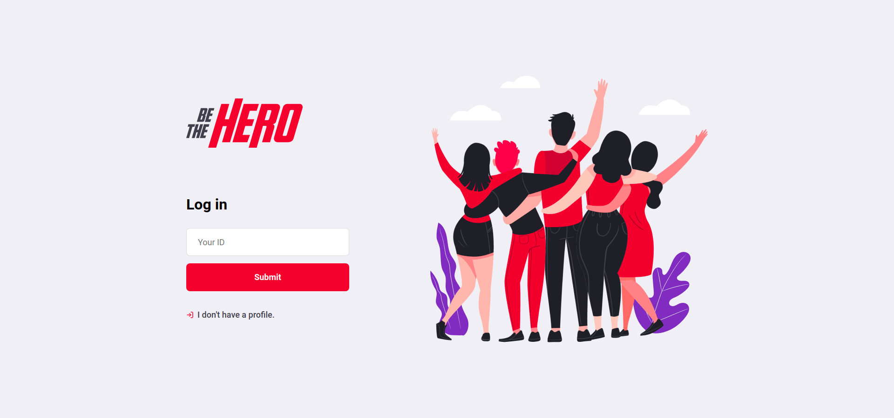
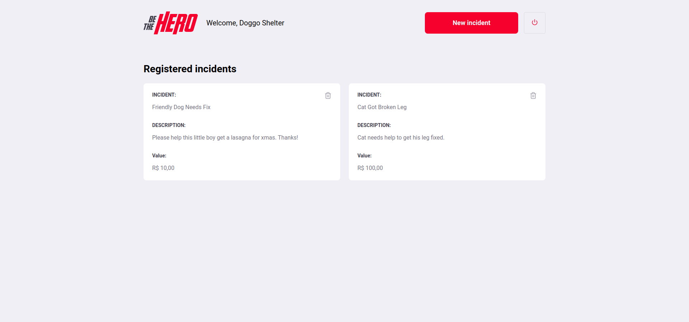
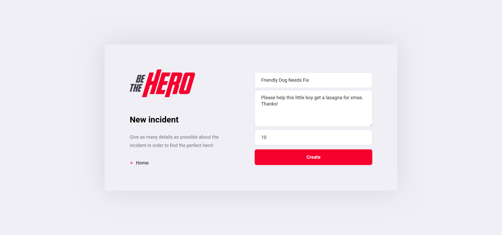
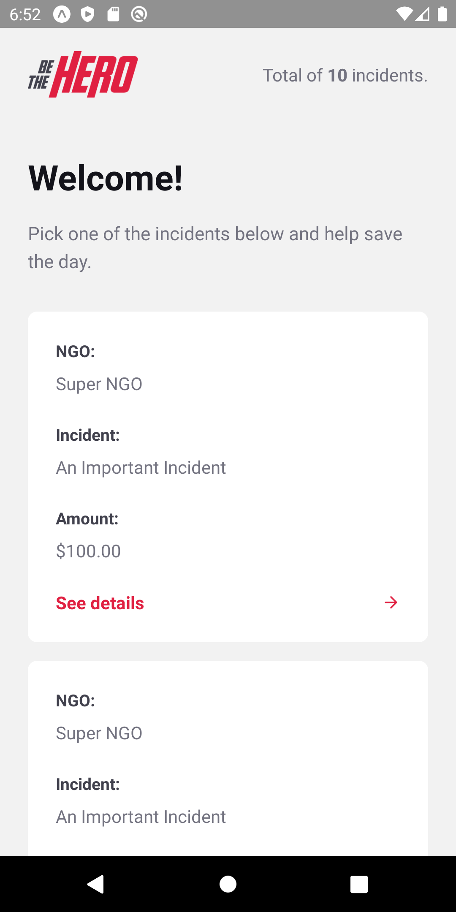
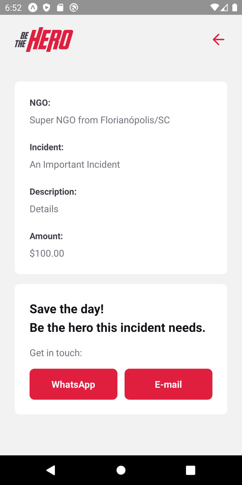

# Be The Hero App

App developed during the 11th OmniStack Week (Semana OmniStack 11.0 | Rocketseat). The goal of this project was to create an app that allows Non-Governmental Organizations (NGOs) (e.g. animal shelters) to ask for financial assistance for specific incidents. The backend was developed with Node.JS and the frontend (desktop and mobile) was made with React.

## Screenshots

### Desktop App

#### Login

#### Sign Up

#### NGO Profile

#### New Incident

### Mobile App

#### Incident List

#### Incident Details

